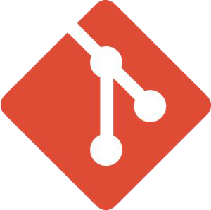

<h3 align="center">Facial expression classification using local binary pattern And support vector machine methods</h3>

<div align="center">


</div>

---

<p align="center"> Experiments on human faces to be implemented in the real world by testing the selected methods.<!DOCTYPE html>

## 🗺️ Language

This paragraph can be read in several languages that can be displayed besides English as the main language, including:

- [Indonesia](./Additional/Language/IDN.md)

## 📝 Table of Contents

1. [Installation](#-installation)
2. [Introduction](#-introduction)
3. [Methodology](#-methodology)
4. [Implementation](#️-implementation)
5. [Result](#-result)
6. [Conclusion](#-conclusion)
7. [Future Work](#-future-work)
8. [References](#-references)

#### 📝 Installation

---

1. [Git](#1--git)
2. [Manual](#️-2-manual)

##### 1.  Git

---

Step 1: Install [Git](./Additional/Understanding.md)

- Open the terminal or [command prompt](./Additional/Understanding.md) on your computer.

- Type the command `sudo apt-get install git` for [Linux](./Additional/Understanding.md) or `git --version` for [Windows](./Additional/Understanding.md) to ensure [Git](./Additional/Understanding.md) is installed.

- If [Git](./Additional/Understanding.md) is not installed, download and install it from the [official Git website](https://git-scm.com/).

Step 2: Clone and Enter the [Repository](./Additional/Understanding.md) Directory

- Open the [Git](./Additional/Understanding.md) [Repository](./Additional/Understanding.md) you want to clone (e.g., on GitHub, GitLab, or Bitbucket).

- Copy the [Repository URL](./Additional/Understanding.md) (there is usually a "Clone" or "Code" button).

- Run the following command in the terminal to clone the [Repository](./Additional/Understanding.md) to your local directory:

  ```bash
  git clone <URL_repository>
  ```

  Example:

  ```bash
   git clone https://github.com/Sancez2002/Facial-Expression-Classification-Using-Local-Binary-Pattern-And-Support-Vector-Machine-Methods.git
  ```

  ```bash
  cd <nama_repository>
  ```

  Example:

  ```bash
  cd repository-name
  ```

Step 3: Retrieve Specific Files or Folders (Optional)

- If you only want to retrieve specific files or folders (without cloning the entire [Repository](./Additional/Understanding.md)), you can use the following commands:

- Add the `--depth 1` option to clone only the latest commit:

  ```bash
  git clone --depth 1 <URL_repository>
  ```

- Use the `git sparse-checkout` command to retrieve specific files or folders:

  ```bash
  git sparse-checkout init --cone
  git sparse-checkout set <nama_folder_atau_file>
  ```

  Example:

  ```bash
  git sparse-checkout set folder-name/file.txt
  ```

#### 🗒️ 2. Manual

---

Step 1: Open the GitHub [Repository](./Additional/Understanding.md)

- Open your browser and access the [GitHub site](https://github.com/).

- Log in to your GitHub account (if required).

- Find the [Repository](./Additional/Understanding.md) that contains the files or folders you want to retrieve.

Step 2: Navigate to the File or Folder

- Once you are in the [Repository](./Additional/Understanding.md), navigate to the file or folder you want to retrieve.

- Click on the name of the file or folder to open its details.

Step 3: Download a Single File

If you only want to download a single file:

- Open the file by clicking on its name. Click the [Raw](./Additional/Understanding.md) button (to view the file's content in text form).

- Right-click on the page and select Save As.

- Choose a save location on your computer and save the file.

Step 4: Download a Folder or Multiple Files

If you want to download a folder or multiple files at once:

- Make sure you are on the main page of the folder you want to download.

- Click the green Code button at the top of the [Repository](./Additional/Understanding.md).

- Select the Download ZIP option.

- A ZIP file containing the entire [Repository](./Additional/Understanding.md) content will be downloaded to your computer.

- Extract the ZIP file to access the folder or files you need.

### 📜 Introduction

---

Sejak kemunculannya pada akhir tahun 2019, pandemi COVID-19 telah memberikan dampak yang sangat besar terhadap kehidupan masyarakat di seluruh dunia, termasuk di Indonesia. Dengan populasi yang besar dan wilayah geografis yang luas, Indonesia menghadapi tantangan unik dalam penanganan dan pengendalian penyebaran virus ini. Pemahaman yang lebih mendalam mengenai dinamika persebaran COVID-19 sangat penting untuk mendukung pengambilan keputusan yang lebih efektif dalam upaya mitigasi dan pengendalian pandemi.

Penelitian ini menggunakan dataset [covid 19 indonesia](https://www.kaggle.com/datasets/hendratno/covid19-indonesia) yang diunduh dari Kaggle untuk menganalisis persebaran kasus COVID-19 di Indonesia selama periode 2020 hingga 2022. Dataset ini mencakup berbagai parameter penting seperti total kematian (total deaths), total kesembuhan (total recovered), dan total kasus (total cases).

Tujuan utama penelitian ini adalah untuk melakukan analisis komprehensif mengenai persebaran kasus COVID-19 di Indonesia berdasarkan:

- **Perbandingan Data Tahunan**: Melakukan perbandingan data tahunan terkait total kematian dan total kesembuhan.

- **Perbandingan Berdasarkan Pulau (Island)**: Melakukan perbandingan data tahunan berdasarkan pulau terkait total kematian dan total kesembuhan.

- **Perbandingan Berdasarkan Provinsi (Province)**: Melakukan perbandingan data tahunan berdasarkan provinsi terkait total kematian dan total kesembuhan.

- **Perbandingan Total Kasus**: Melakukan perbandingan data tahunan terkait total kasus.

Penelitian ini diharapkan dapat memberikan wawasan yang lebih mendalam mengenai pola penyebaran COVID-19 di Indonesia dan menjadi dasar bagi pembuatan kebijakan kesehatan yang lebih efektif di masa mendatang.

### 🔍 Methodology

---

Penelitian ini bertujuan untuk menganalisis persebaran kasus COVID-19 di Indonesia selama periode 2020 hingga 2022. Metodologi yang digunakan dalam penelitian ini mencakup beberapa langkah yang sistematis dan terstruktur untuk memastikan analisis yang akurat dan dapat diandalkan.

1. **Sumber Data**
   <br>
   Dataset yang digunakan dalam penelitian ini diunduh dari Kaggle [covid 19 indonesia](https://www.kaggle.com/datasets/hendratno/covid19-indonesia). Dataset ini mencakup data tanggal harian mengenai total kasus, total kematian, dan total kesembuhan yang tercatat di berbagai provinsi dan benua di Indonesia.

2. **Pembersihan Data**
   <br>
   Proses pembersihan data dilakukan untuk memastikan integritas dan konsistensi data. Langkah-langkah yang diambil termasuk:

   - Memeriksa data untuk mengidentifikasi dan menangani nilai yang hilang atau tidak valid.
   - Mengubah format tanggal menjadi tipe data datetime untuk memudahkan analisis berbasis waktu.
   - Memastikan konsistensi nama provinsi dan pulau.

3. **Pengolahan Data**
   <br>
   Data diolah untuk menghasilkan variabel-variabel yang diperlukan untuk analisis. Beberapa langkah yang dilakukan termasuk:

   - Menggantikan kolom tanggal berdasarkan tahun untuk analisis tahunan.
   - Mengelompokkan data berdasarkan pulau dan provinsi.
   - Menghitung total kasus, total kematian, dan total kesembuhan per tahun, pulau, dan provinsi.

4. **Analisis Data**
   <br>
   Analisis data dilakukan untuk menjawab pertanyaan penelitian yang telah dirumuskan. Analisis yang dilakukan meliputi:

   - **Perbandingan Data Tahunan**: Membandingkan data tahunan terkait total kematian dan total kesembuhan.
   - **Perbandingan Berdasarkan Pulau**: Membandingkan data tahunan berdasarkan pulau terkait total kematian dan total kesembuhan.
   - **Perbandingan Berdasarkan Provinsi**: Membandingkan data tahunan berdasarkan provinsi terkait total kematian dan total kesembuhan.
   - **Perbandingan Total Kasus**: Membandingkan data tahunan terkait total kasus.

5. **Visualisasi Data**
   <br>
   Hasil analisis data divisualisasikan untuk memudahkan interpretasi dan penyajian informasi. Alat visualisasi yang digunakan termasuk:

   - **Line Plot**: Untuk menampilkan tren tahunan total kematian, total kesembuhan, dan total kasus.
   - **Bar Plot**: Untuk membandingkan total kematian dan total kesembuhan berdasarkan pulau dan provinsi.

6. **Validasi Hasil**
   Validasi hasil dilakukan untuk memastikan keakuratan dan konsistensi analisis. Langkah-langkah validasi termasuk:
   - Memeriksa ulang hasil perhitungan dan visualisasi.
   - Membandingkan hasil analisis dengan laporan resmi dan studi lain yang relevan.

### 🛠️ Implementation

---

### 📊 Result

---

### 🎯 Conclusion

---

### 🏃 Future Work

---

### 📚 References

---

- [World Health Organization (WHO). (2020). Coronavirus disease (COVID-19) pandemic](https://www.who.int/emergencies/diseases/novel-coronavirus-2019)

- [Kementerian Kesehatan Republik Indonesia. (2020). Pedoman Pencegahan dan Pengendalian Coronavirus Disease (COVID-19)](https://covid19.kemkes.go.id/protokol-covid-19)

- [John Hopkins University & Medicine. (2020). COVID-19 Dashboard](https://coronavirus.jhu.edu/map.html)

- [Kaggle. (2020). COVID-19 Indonesia Dataset](https://www.kaggle.com/datasets/hendratno/covid19-indonesia)

#### ✍🏻 Authors

---
